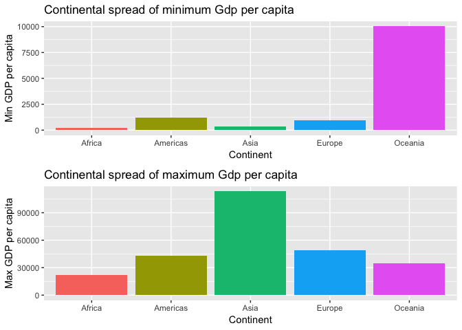
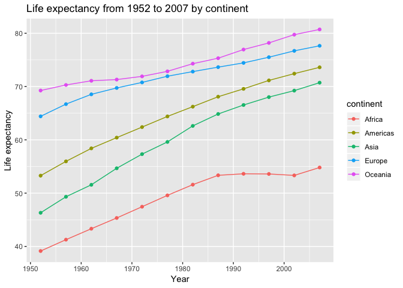

HW03\_KZ
================

Welcome to my 3rd assignment!
=============================

In this assignment I will be using dplyr/ggplot2 to manipulate and explore data

Below I accomplish 3 tasks:

1.  Calculate and visualize the maximum and minimum of GDP per capita for all continents.

2.  Figure out how life expectancy changing over time on different continents, and visualize it.

3.  Look at, and visualize the spread of population within the continents

I accomplish these tasks using the *gapmnder* data set. I do these tasks in a concise way to keep it clean and reduce clutter, or confusion. I appreciate straight forward data manipulation and show this style in my work through minimal coding, clear explanations of my actions, clean spacing, and simple visualizations.

``` r
#Firstly I will load te packages. I will suppress them to quiet the libray call outs on my code and keep my code clean
suppressPackageStartupMessages(library(gapminder))
suppressPackageStartupMessages(library(tidyverse))
suppressPackageStartupMessages(library(knitr))
suppressPackageStartupMessages(library(grid))
suppressPackageStartupMessages(library(gridExtra))
```

1) Get the maximum and minimum of GDP per capita for all continents.
--------------------------------------------------------------------

Firstly, I create a table for all the continents showing the minimum and maximum GDPs. I store this in a value called "Max\_Min\_gdpPercap\_continent" so I can easily recall the manipulation for a table and a plot.

``` r
Max_Min_gdpPercap_continent <- gapminder %>%
  group_by(continent) %>%
    summarize(min_gdpPercap = min(gdpPercap),
            max_gdpPercap = max(gdpPercap))

Max_Min_gdpPercap_continent %>%
  kable(align = "c")
```

| continent | min\_gdpPercap | max\_gdpPercap |
|:---------:|:--------------:|:--------------:|
|   Africa  |    241.1659    |    21951.21    |
|  Americas |    1201.6372   |    42951.65    |
|    Asia   |    331.0000    |    113523.13   |
|   Europe  |    973.5332    |    49357.19    |
|  Oceania  |   10039.5956   |    34435.37    |

When plotting these values, we can create 2 plots, one showing both maximum GDP and another showing minimum GDP.

``` r
Min_graph <- Max_Min_gdpPercap_continent %>%
  ggplot(aes(continent,min_gdpPercap, fill=continent)) +
    geom_col() +
    ggtitle("Continental spread of minimum Gdp per capita") +
    xlab("Continent") +
    ylab("Min GDP per capita") +
    theme(legend.position = "none")
```

``` r
Max_graph <- Max_Min_gdpPercap_continent %>%
  ggplot(aes(continent,max_gdpPercap, fill=continent)) +
    geom_col() +
    ggtitle("Continental spread of maximum Gdp per capita") +
    xlab("Continent") +
    ylab("Max GDP per capita")+
    theme(legend.position = "none")
```

I have created a graph for both min GDP and max GDP, I will put them next to each other for easy comparison

``` r
grid.arrange(Min_graph, Max_graph)
```



After creating this visualization I think it would be informative to create a graph showing the difference betweeen the maximum and minimum GDP for each continent-- to see the spread.

``` r
Spread_gdpPercap_continent <- gapminder %>%
  group_by(continent) %>%
    summarize(min_gdpPercap = min(gdpPercap),
            max_gdpPercap = max(gdpPercap), GDP_spread = (max_gdpPercap-min_gdpPercap))

Spread_gdpPercap_continent %>%
  kable(align = "c")
```

| continent | min\_gdpPercap | max\_gdpPercap | GDP\_spread |
|:---------:|:--------------:|:--------------:|:-----------:|
|   Africa  |    241.1659    |    21951.21    |   21710.05  |
|  Americas |    1201.6372   |    42951.65    |   41750.02  |
|    Asia   |    331.0000    |    113523.13   |  113192.13  |
|   Europe  |    973.5332    |    49357.19    |   48383.66  |
|  Oceania  |   10039.5956   |    34435.37    |   24395.77  |

``` r
Spread_gdpPercap_continent %>%
  ggplot(aes(continent,GDP_spread, fill=continent)) +
    geom_col() +
    ggtitle("Continental spread of Gdp per capita (max - min)") +
    xlab("Continent") +
    ylab("Difference in GDP") +
    theme(legend.position = "none")
```


This graph shows the size of the difference between max GDP and min GDP in each continent-- it looks like Asia has the largest spread in GDP and Africa has the smallest.

2) How is life expectancy changing over time on different continents?
---------------------------------------------------------------------

``` r
lifeExp_peryear <- gapminder %>%
  group_by(continent, year) %>%
  summarize(Average_lifeExp = mean(lifeExp))

lifeExp_peryear %>%
kable(align = "c")
```

| continent | year | Average\_lifeExp |
|:---------:|:----:|:----------------:|
|   Africa  | 1952 |     39.13550     |
|   Africa  | 1957 |     41.26635     |
|   Africa  | 1962 |     43.31944     |
|   Africa  | 1967 |     45.33454     |
|   Africa  | 1972 |     47.45094     |
|   Africa  | 1977 |     49.58042     |
|   Africa  | 1982 |     51.59287     |
|   Africa  | 1987 |     53.34479     |
|   Africa  | 1992 |     53.62958     |
|   Africa  | 1997 |     53.59827     |
|   Africa  | 2002 |     53.32523     |
|   Africa  | 2007 |     54.80604     |
|  Americas | 1952 |     53.27984     |
|  Americas | 1957 |     55.96028     |
|  Americas | 1962 |     58.39876     |
|  Americas | 1967 |     60.41092     |
|  Americas | 1972 |     62.39492     |
|  Americas | 1977 |     64.39156     |
|  Americas | 1982 |     66.22884     |
|  Americas | 1987 |     68.09072     |
|  Americas | 1992 |     69.56836     |
|  Americas | 1997 |     71.15048     |
|  Americas | 2002 |     72.42204     |
|  Americas | 2007 |     73.60812     |
|    Asia   | 1952 |     46.31439     |
|    Asia   | 1957 |     49.31854     |
|    Asia   | 1962 |     51.56322     |
|    Asia   | 1967 |     54.66364     |
|    Asia   | 1972 |     57.31927     |
|    Asia   | 1977 |     59.61056     |
|    Asia   | 1982 |     62.61794     |
|    Asia   | 1987 |     64.85118     |
|    Asia   | 1992 |     66.53721     |
|    Asia   | 1997 |     68.02052     |
|    Asia   | 2002 |     69.23388     |
|    Asia   | 2007 |     70.72848     |
|   Europe  | 1952 |     64.40850     |
|   Europe  | 1957 |     66.70307     |
|   Europe  | 1962 |     68.53923     |
|   Europe  | 1967 |     69.73760     |
|   Europe  | 1972 |     70.77503     |
|   Europe  | 1977 |     71.93777     |
|   Europe  | 1982 |     72.80640     |
|   Europe  | 1987 |     73.64217     |
|   Europe  | 1992 |     74.44010     |
|   Europe  | 1997 |     75.50517     |
|   Europe  | 2002 |     76.70060     |
|   Europe  | 2007 |     77.64860     |
|  Oceania  | 1952 |     69.25500     |
|  Oceania  | 1957 |     70.29500     |
|  Oceania  | 1962 |     71.08500     |
|  Oceania  | 1967 |     71.31000     |
|  Oceania  | 1972 |     71.91000     |
|  Oceania  | 1977 |     72.85500     |
|  Oceania  | 1982 |     74.29000     |
|  Oceania  | 1987 |     75.32000     |
|  Oceania  | 1992 |     76.94500     |
|  Oceania  | 1997 |     78.19000     |
|  Oceania  | 2002 |     79.74000     |
|  Oceania  | 2007 |     80.71950     |

``` r
lifeExp_peryear %>%
  ggplot(aes(year, Average_lifeExp, colour=continent)) +
    geom_line() +
    geom_point() +
    ggtitle("Life expectancy from 1952 to 2007 by continent") +
    xlab("Year") +
    ylab("Life expectancy")
```



3) Look at, and visualize the spread of population within the continents in
---------------------------------------------------------------------------

``` r
Spread_pop_continent <- gapminder %>%
  group_by(continent) %>%
    summarize(min_pop = min(pop),
            max_pop = max(pop),
            mean_pop = mean(pop),
            median_popo = median(pop),
            sd_pop = sd(pop))

Spread_pop_continent %>%
  kable(align = "c")
```

| continent | min\_pop |  max\_pop  | mean\_pop | median\_popo |  sd\_pop  |
|:---------:|:--------:|:----------:|:---------:|:------------:|:---------:|
|   Africa  |   60011  |  135031164 |  9916003  |    4579311   |  15490923 |
|  Americas |  662850  |  301139947 |  24504795 |    6227510   |  50979430 |
|    Asia   |  120447  | 1318683096 |  77038722 |   14530830   | 206885205 |
|   Europe  |  147962  |  82400996  |  17169765 |    8551125   |  20519438 |
|  Oceania  |  1994794 |  20434176  |  8874672  |    6403492   |  6506342  |

``` r
gapminder %>%
  ggplot(aes(continent, pop)) +
    scale_y_log10() + #we scale because without it, the outliers make it difficult to see the spread
    geom_boxplot(aes(colour=continent)) + 
    geom_jitter(aes(colour=continent), alpha=0.1) +
    ggtitle("Spread of population (1952-2007)") + 
    xlab("Continent") + 
    ylab("Population")
```


